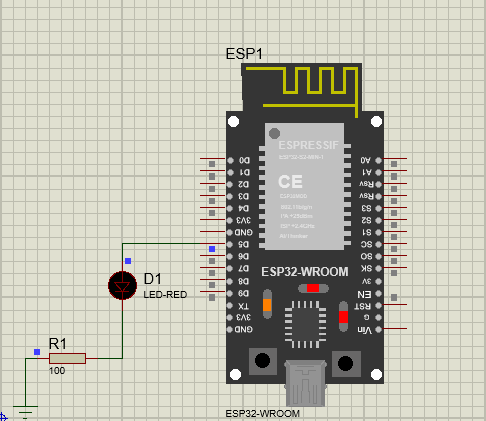
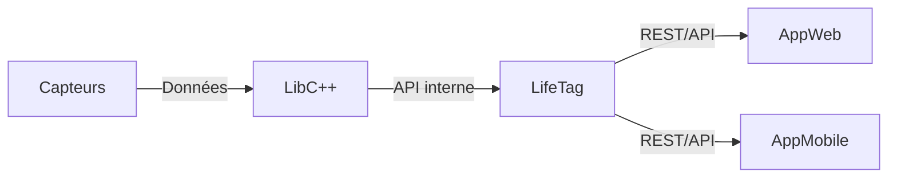

# 🏥 LifeTag

### 📿 Notre LOGO


**LifeTag** est un bracelet intelligent piloté par **IA**, développé dans le cadre du CESI.  
Le projet allie **ingénierie embarquée**, **santé connectée** et **intelligence artificielle** pour enregistrer et suivre les informations des patients (constantes, événements médicaux, alertes, etc.).

## 📁 Structure du projet

```
repo/LifeTag
├── AppMobile      # Application mobile (à venir)
├── AppWeb         # Interface web (dashboard)
├── doc            # Documentation technique
├── lab            # Prototypes & expérimentations
├── LifeTag_Arduino# Application principale (LifeTag)
├── driver_ESP32   # Artefacts générés (.a, .so, exécutable)
├── driver_Proteus # Artefacts générés (.a, .so, exécutable)
├── CMakeLists.txt # Build principal
├── startup.sh     # Script de build & packaging
└── README.md      # Ce fichier
└── CONTRIBUTING.md  # Guide de contribution
└── LICENSE          # Licence du projet
```

## ⚙️ Build & Exécution

### 🔨 Compilation

Toutes les étapes (configuration, compilation, génération des bibliothèques) sont automatisées via `startup.sh` :

```bash
./startup.sh
```

### ▶️ Exécution


## 🧪 Tests unitaires

Les tests unitaires sont gérés avec **GoogleTest** et intégrés au processus de build via `startup.sh`.

### Installation de GoogleTest (une seule fois)

Assurez-vous que les dépendances sont installées et que GoogleTest est compilé (nécessaire sur Debian/Ubuntu) :

```bash
sudo apt update
sudo apt install -y libgtest-dev cmake g++
cd /usr/src/gtest
sudo cmake .
sudo make -j$(nproc)
sudo cp lib/*.a /usr/lib
```

Les résultats détaillés s’affichent en cas d’échec.  
Les tests couvrent la logique métier de la bibliothèque et de l’application principale.

## 🌐 Interface Web

Un prototype de dashboard est disponible dans `AppWeb/` :

- Affichage du logo et du nom GreenMind
- Curseur de luminosité
- Boutons pour ouvrir la porte et arroser

Pour lancer le dashboard :

```bash
cd AppWeb
python3 -m http.server 8080
```
Accéder à [http://localhost:8080](http://localhost:8080).

## 📦 Bin générées

Dans `driver/` :
    ├── main.ino.bin
    ├── main.ino.bootloader.bin
    ├── main.ino.elf
    ├── main.ino.map
    ├── main.ino.merged.bin
    └── main.ino.partitions.bin

## 🗺️ Architecture du projet


## 📟 Arduino - Compilation pour ESP32 et simulation Proteus 8

```mermaid
flowchart TD
    for ESP32 reel board : go to LifeTag_Ardino and use this command : arduino-cli compile --fqbn esp32:esp32:esp32 --output-dir ../bin --verbose
    for ESP32 proteus simulation (.ino.elf) use this command : arduino-cli compile --fqbn arduino:avr:uno --output-dir ../build --verbose
```

## 👨‍💻 Auteurs

Projet développé par Équipe CESI:

- Chef de projet                : **DBIBIH Oussama**
- Responsables technique        : **Thomas Castello** & **Damien Navarri**
- Responsables business         : **Matthis Marti**
- Responsables communication    : **Quentin Hallier** & **Lucas Giraud**