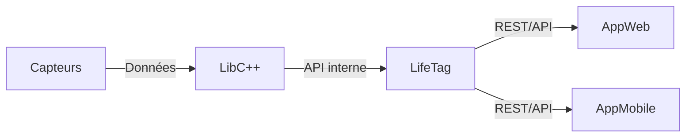

# 🏥 LifeTag

### 📿 Notre LOGO


**LifeTag** est un bracelet intelligent piloté par **IA**, développé dans le cadre du CESI.  
Le projet allie **ingénierie embarquée**, **santé connectée** et **intelligence artificielle** pour enregistrer et suivre les informations des patients (constantes, événements médicaux, alertes, etc.).

## 📁 Structure du projet

```
repo/LifeTag
├── AppMobile      # Application mobile (à venir)
├── AppWeb         # Interface web (dashboard)
├── doc            # Documentation technique
├── lab            # Prototypes & expérimentations
├── lib            # Bibliothèque interne (core)
│   ├── inc        # Headers publics
│   ├── src        # Sources
│   └── CMakeLists.txt
├── main           # Application principale (LifeTag)
├── test           # Tests unitaires (GoogleTest)
├── driver         # Artefacts générés (.a, .so, exécutable)
├── CMakeLists.txt # Build principal
├── startup.sh     # Script de build & packaging
└── README.md      # Ce fichier
```

## ⚙️ Build & Exécution

### 🔨 Compilation

Le projet utilise **CMake** et **GCC**.  
Toutes les étapes (configuration, compilation, génération des bibliothèques) sont automatisées via `startup.sh` :

```bash
./startup.sh
```

À la fin, le dossier `driver/` contient :
- l’exécutable `LifeTag`
- la bibliothèque statique `libLifeTag.a`
- la bibliothèque dynamique `libLifeTag.so`

### ▶️ Exécution

Lancer l’application principale :

```bash
./driver/LifeTag
```

Sortie attendue :
```
=== Bienvenue dans LifeTag ===
Version : LifeTag v0.1.0
```

## 🧪 Tests unitaires

Les tests unitaires sont gérés avec **GoogleTest** et intégrés au processus de build via `startup.sh`.

### Installation de GoogleTest (une seule fois)

Assurez-vous que les dépendances sont installées et que GoogleTest est compilé (nécessaire sur Debian/Ubuntu) :

```bash
sudo apt update
sudo apt install -y libgtest-dev cmake g++
cd /usr/src/gtest
sudo cmake .
sudo make -j$(nproc)
sudo cp lib/*.a /usr/lib
```

### Exécution des tests

Après compilation du projet, lancez les tests depuis le dossier `build` :

```bash
cd build
ctest --output-on-failure
```

Les résultats détaillés s’affichent en cas d’échec.  
Les tests couvrent la logique métier de la bibliothèque et de l’application principale.

## 🌐 Interface Web

Un prototype de dashboard est disponible dans `AppWeb/` :

- Affichage du logo et du nom GreenMind
- Curseur de luminosité
- Boutons pour ouvrir la porte et arroser

Pour lancer le dashboard :

```bash
cd AppWeb
python3 -m http.server 8080
```
Accéder à [http://localhost:8080](http://localhost:8080).

## 📦 Bibliothèques générées

Dans `driver/` :
- **Statique** : `libLifeTag.a`
- **Dynamique** : `libLifeTag.so`

Ces bibliothèques contiennent la logique interne réutilisable (mobile, web, services externes).

## 🗺️ Architecture du projet



## 👨‍💻 Auteurs

Projet développé par Équipe CESI:

- Chef de projet                : **DBIBIH Oussama**
- Responsables technique        : **Thomas Castello** & **Damien Navarri**
- Responsables business         : **Matthis Marti**
- Responsables communication    : **Quentin Hallier** & **Lucas Giraud**